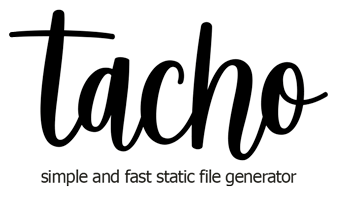

Tacho is simple NodeJS script to glue pages with layout using HandlbarsJS as templates and yaml files for data.

# CLI

## Create new site
```node tachojs create [site]```

## Build site
```node tachojs build [site]```

